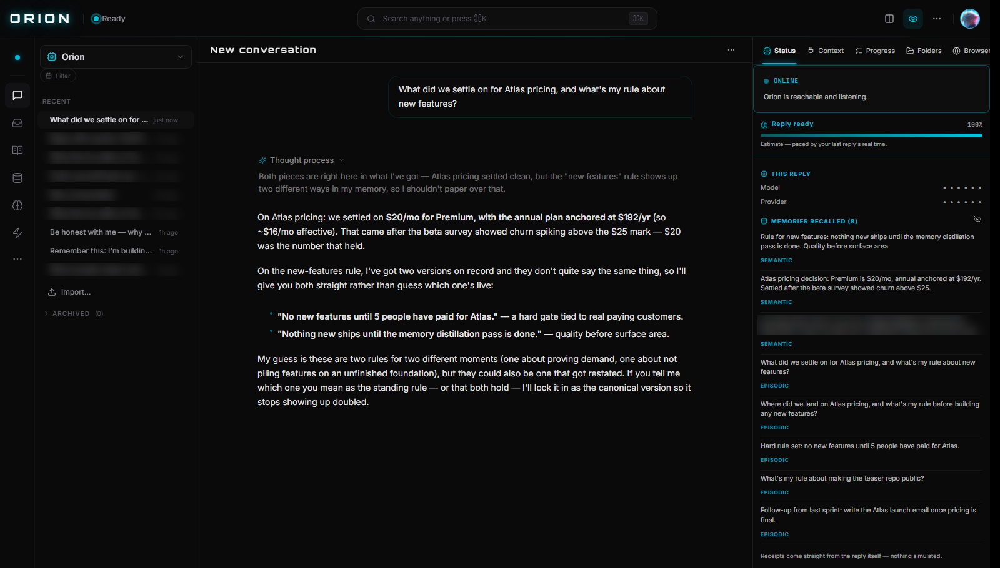

# Orion — the AI that remembers you

**A private cognitive OS for Windows. Its memory is files on YOUR disk — not rows in someone else's cloud.**

`local-first` · `bring-your-own-keys` · `no cloud account` · `Windows`

---

## See it remember

Captured live through the real product (demo scenario: "Atlas" pricing). Watch what actually happens: the visible <b>Thought process</b> reasons over memory in plain language, the answer recalls the decision from a previous conversation — and instead of smoothing it over, Orion flags that its memory holds <i>two different versions</i> of the feature rule and asks which one is canonical. That's the honesty layer working in public. The right panel lists the exact memories used; model/provider stay masked by Orion's own privacy default. One private memory row and my other conversations are blurred — the only edit. Nothing is simulated.

## Why I'm building this

I got sick of AI amnesia. You work with an assistant for months, and every single session starts from zero — re-explain the project, re-explain the decisions, re-explain *why*. The tools are smart; they just don't know you.

Then December 2025 made the other problem obvious: the best-known "AI memory" product got acquired, and two weeks later its app was sunset — people lost years of what they'd captured. A memory you don't hold is a loan.

So I'm building the thing I actually wanted: a thinking and memory layer that runs **on your own computer**, above **any model you choose**. Close it tonight; tomorrow it still knows you. And nobody can take the memory away, because it's yours — plain files, on your disk.

## What it does (in the build today)

- **Memory that persists and reasons** — conversations distill into structured memory with real recall. Ask *"what did I decide about X, and why?"* and it answers with the rationale intact.
- **Any model, your keys** — bring your own API keys (provider-direct, zero markup) or run fully local with zero cloud. Model choice is never gated by pricing.
- **A real pipeline underneath** — 277 cognition layers routed per query, a visible reasoning trace, and per-turn gate reports. When an internal check couldn't run, it says so instead of pretending.
- **Eyes, opt-in** — screen vision with a watch mode that wakes only on real change. Off by default, visible indicator, instant off.
- **Deep research** — live web search in chat plus a deep-search mode.
- **Hands** — an agentic layer: run commands, edit files, finish multi-step work, with ask-before-acting control.
- **Voice** — talk to it, wake phrases, voice memos it remembers, audio overviews of your own material.
- **A daily diary it writes itself** — what it learned, what changed, what it got wrong. You can ratify or dispute it.

80+ live views inside — memory browser, knowledge graph, disagreement inbox, constitution, secrets vault, audit log, sandbox, a local `/v1` API, and more. It's not a thin app.

## Where's the source?

Closed source, local-first by architecture. No account, no telemetry decisions made for you — what leaves your machine is exactly what you send your model provider, nothing else. Your memory is plain files under your own user folder: back it up, move it, read it yourself. There are no servers on my end to sunset.

## Who's building this

Just me. No company, no VC, no growth team — one builder who wanted an AI that actually knows him and got tired of waiting for someone else to make it.

I use Orion to build Orion. Its memory of past decisions — what we picked, what we rejected, and why — is literally how this project survives between sessions. Every feature on this page exists because I personally hit the wall it removes.

If you buy it, you're not funding a subscription farm. You're funding one stubborn person proving that a personal AI doesn't need to live in someone else's cloud.

## Pricing (at launch)

| Tier | Price | Notes |
|---|---|---|
| **Free** | $0 | full memory, any model via your keys, screen vision, web + deep search, 50 thinks/day |
| **Premium** | $20/mo or $192/yr | everything uncapped, multi-model side-by-side, reasoning trace |
| **Charter Member** | $200 once | lifetime license, 100 slots total, rate locked for life |

30-day money-back on every paid tier. Model calls always go to your provider at cost — $0 markup.

## Tell me if you'd use this

I'm gauging real interest before the launch, so signals matter more than politeness:

- ⭐ **Star or watch this repo** if you'd try it — the download and buy links land here first.
- 🗣 **Open an issue** and tell me why you would — or wouldn't — pay for this. Brutal, specific feedback beats encouragement. What would make it a day-one buy for you?

---

© 2026 Orion · Windows today · Your memory is files on your disk.
